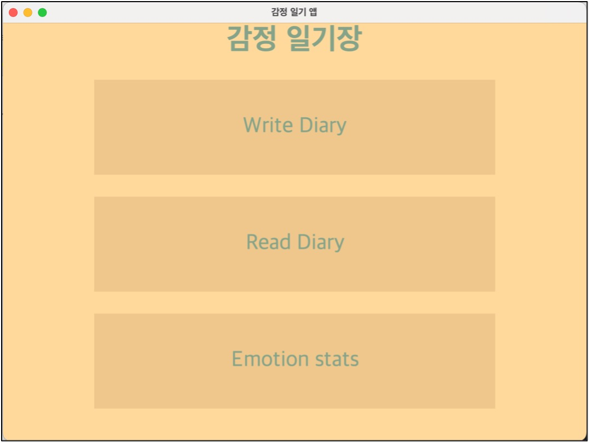
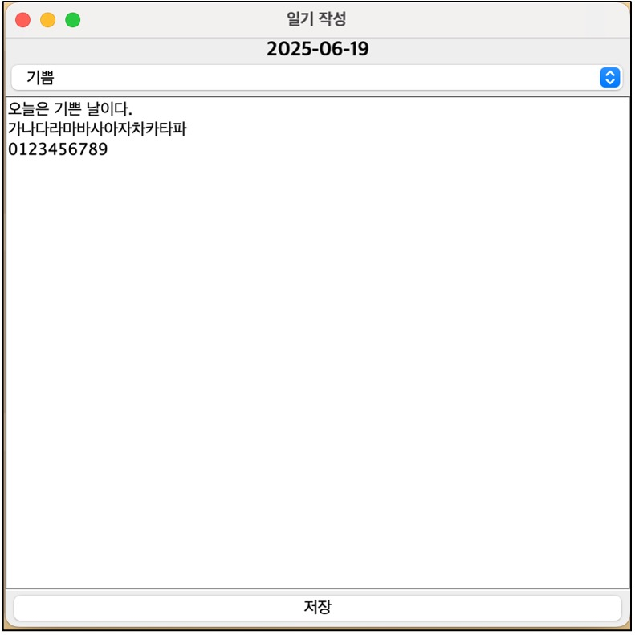
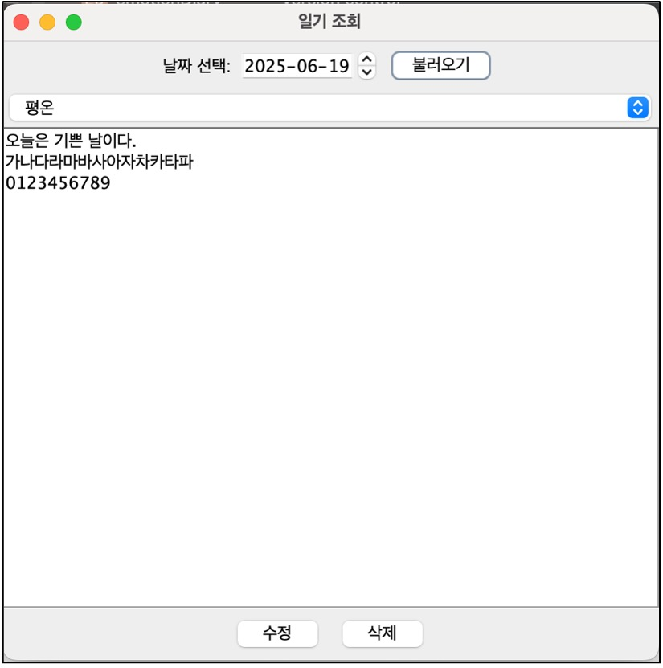
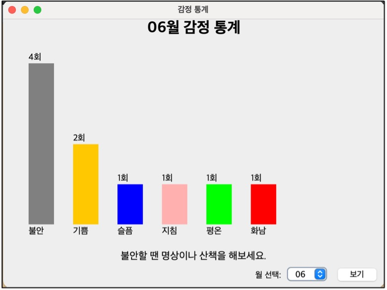

# Emotion Diary Application (Java Swing)

## 📌 소개
**해당 프로젝트는 자바 프로그래밍 교과의 Term Project로 진행되었습니다.**

해당 애플리케이션은 사용자가 감정과 일기를 기록하고  
감정 통계를 시각적으로 확인할 수 있는 데스크톱 프로그램입니다.

Swing을 활용해 GUI를 직접 구성하였습니다.

## 🎯 주요 기능
- 감정 선택, 일기 작성
- 날짜 기반 일기 조회 및 수정/삭제
- 월별 감정 통계 그래프 제공
- 감정 기반 조언 메시지 표시

## 🖼️ 사용 예시
<table>
  <tr>
    <td align="center" width="50%">
       
      <b>Main Frame</b> 사용자가 원하는 기능을 선택하는 프로그램의 시작점입니다.
    </td>
    <td align="center" width="50%">
       
      <b>Write Diary</b> 사용자가 원하는 감정을 선택하고 직접 일기를 작성하는 화면입니다.
    </td>
  </tr>
  <tr>
    <td align="center" width="50%">
       
      <b>Read Diary</b> 날짜별로 작성한 일기를 확인하며 필요 시 내용을 수정할 수 있습니다.
    </td>
    <td align="center" width="50%">
       
      <b>Emotion statistics</b> 감정 통계를 바탕으로 맞춤형 조언을 제공하는 화면입니다.
    </td>
  </tr>
</table>

## ⚙️ 실행 방법
1. Java 17 이상 설치  
2. 프로젝트를 클론 또는 다운로드
3. IDE (Eclipse, IntelliJ 등)로 열기  
4. src 내의 `Main.java` 실행

## 📁 폴더 구조
- `src/` : Java 소스 코드  
- `diaries/` : 일기 텍스트 파일 저장 위치 (샘플 데이터 존재)
- `screenshots/` : 실행 화면 캡처

## ✅ 개발 환경
- Java 21  
- GUI: Java Swing

## 💡 향후 발전 방향
- 사용자 지정 기간 통계 제공  
- 감정 맞춤형 외부 콘텐츠 추천 
- 감정 다각도 분석을 통한 맞춤형 시스템
